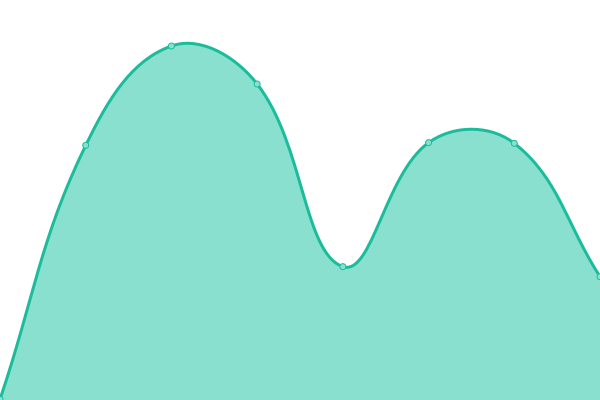

# [📈 Live Status](https://demo.upptime.js.org): <!--live status--> **🟧 Partial outage**

This repository contains the open-source uptime monitor and status page for [Upptime](https://upptime.js.org), powered by [Upptime](https://github.com/upptime/upptime).

With [Upptime](https://upptime.js.org), you can get your own unlimited and free uptime monitor and status page, powered entirely by a GitHub repository. We use [Issues](https://github.com/upptime/upptime/issues) as incident reports, [Actions](https://github.com/muuvlabs-upptime/muuvlabs-upptime/actions) as uptime monitors, and [Pages](https://demo.upptime.js.org) for the status page.

<!--start: status pages-->
<!-- This summary is generated by Upptime (https://github.com/upptime/upptime) -->
<!-- Do not edit this manually, your changes will be overwritten -->
<!-- prettier-ignore -->
| URL | Status | History | Response Time | Uptime |
| --- | ------ | ------- | ------------- | ------ |
|  [Community Production](https://community.sebrands.com/community/_healthz) | 🟩 Up | [community-production.yml](https://github.com/muuvlabs-upptime/muuvlabs-upptime/commits/HEAD/history/community-production.yml) | 

 253ms
     
 | 

<a href="https://muuvlabs-upptime.github.io/muuvlabs-upptime/history/community-production">100.00%</a>
    

|  [Program Engine Production](https://pe.sebrands.com/pe/_healthz) | 🟩 Up | [program-engine-production.yml](https://github.com/muuvlabs-upptime/muuvlabs-upptime/commits/HEAD/history/program-engine-production.yml) | 

 204ms
     
 | 

<a href="https://muuvlabs-upptime.github.io/muuvlabs-upptime/history/program-engine-production">100.00%</a>
    

|  [Nutrition Production](https://nutrition.sebrands.com/nutrition/_healthz) | 🟩 Up | [nutrition-production.yml](https://github.com/muuvlabs-upptime/muuvlabs-upptime/commits/HEAD/history/nutrition-production.yml) | 

 144ms
     
 | 

<a href="https://muuvlabs-upptime.github.io/muuvlabs-upptime/history/nutrition-production">100.00%</a>
    

|  [Referrals Production](https://referrals.sebrands.com/referrals/scripts/landing.js) | 🟩 Up | [referrals-production.yml](https://github.com/muuvlabs-upptime/muuvlabs-upptime/commits/HEAD/history/referrals-production.yml) | 

 224ms
     
 | 

<a href="https://muuvlabs-upptime.github.io/muuvlabs-upptime/history/referrals-production">100.00%</a>
    

|  [VHS Production](https://vhs.sebrands.com/vhs/episodes) | 🟩 Up | [vhs-production.yml](https://github.com/muuvlabs-upptime/muuvlabs-upptime/commits/HEAD/history/vhs-production.yml) | 

 200ms
     
 | 

<a href="https://muuvlabs-upptime.github.io/muuvlabs-upptime/history/vhs-production">100.00%</a>
    

|  [Community Staging](https://stage-community.sebrands.com/community/_healthz) | 🟩 Up | [community-staging.yml](https://github.com/muuvlabs-upptime/muuvlabs-upptime/commits/HEAD/history/community-staging.yml) | 

 318ms
     
 | 

<a href="https://muuvlabs-upptime.github.io/muuvlabs-upptime/history/community-staging">100.00%</a>
    

|  [Program Engine Staging](https://stage-pe.sebrands.com/pe/_healthz) | 🟩 Up | [program-engine-staging.yml](https://github.com/muuvlabs-upptime/muuvlabs-upptime/commits/HEAD/history/program-engine-staging.yml) | 

 180ms
     
 | 

<a href="https://muuvlabs-upptime.github.io/muuvlabs-upptime/history/program-engine-staging">100.00%</a>
    

|  [Nutrition Staging](https://stage-nutrition.sebrands.com/nutrition/_healthz) | 🟩 Up | [nutrition-staging.yml](https://github.com/muuvlabs-upptime/muuvlabs-upptime/commits/HEAD/history/nutrition-staging.yml) | 

 165ms
     
 | 

<a href="https://muuvlabs-upptime.github.io/muuvlabs-upptime/history/nutrition-staging">100.00%</a>
    

|  [Referrals Staging](https://stage-referrals.sebrands.com/referrals/scripts/landing.js) | 🟩 Up | [referrals-staging.yml](https://github.com/muuvlabs-upptime/muuvlabs-upptime/commits/HEAD/history/referrals-staging.yml) | 

 148ms
     
 | 

<a href="https://muuvlabs-upptime.github.io/muuvlabs-upptime/history/referrals-staging">100.00%</a>
    

|  [VHS Staging](https://stage-vhs.sebrands.com/vhs/episodes) | 🟩 Up | [vhs-staging.yml](https://github.com/muuvlabs-upptime/muuvlabs-upptime/commits/HEAD/history/vhs-staging.yml) | 

 305ms
     
 | 

<a href="https://muuvlabs-upptime.github.io/muuvlabs-upptime/history/vhs-staging">100.00%</a>
    

|  [Google](https://www.google.com) | 🟩 Up | [google.yml](https://github.com/muuvlabs-upptime/muuvlabs-upptime/commits/HEAD/history/google.yml) | 

 86ms
     
 | 

<a href="https://muuvlabs-upptime.github.io/muuvlabs-upptime/history/google">100.00%</a>
    

|  [Wikipedia](https://en.wikipedia.org) | 🟩 Up | [wikipedia.yml](https://github.com/muuvlabs-upptime/muuvlabs-upptime/commits/HEAD/history/wikipedia.yml) | 

 178ms
     
 | 

<a href="https://muuvlabs-upptime.github.io/muuvlabs-upptime/history/wikipedia">100.00%</a>
    

|  [Hacker News](https://news.ycombinator.com) | 🟩 Up | [hacker-news.yml](https://github.com/muuvlabs-upptime/muuvlabs-upptime/commits/HEAD/history/hacker-news.yml) | 

 274ms
     
 | 

<a href="https://muuvlabs-upptime.github.io/muuvlabs-upptime/history/hacker-news">100.00%</a>
    

|  [Test Broken Site](https://thissitedoesnotexist.koj.co) | 🟥 Down | [test-broken-site.yml](https://github.com/muuvlabs-upptime/muuvlabs-upptime/commits/HEAD/history/test-broken-site.yml) | 

 0ms
     
 | 

<a href="https://muuvlabs-upptime.github.io/muuvlabs-upptime/history/test-broken-site">100.00%</a>
    

<!--end: status pages-->

[**Visit our status website →**](https://demo.upptime.js.org)

## 📄 License

- Powered by: [Upptime](https://github.com/upptime/upptime)
- Code: [MIT](./LICENSE) © [Upptime](https://upptime.js.org)
- Data in the `./history` directory: [Open Database License](https://opendatacommons.org/licenses/odbl/1-0/)
