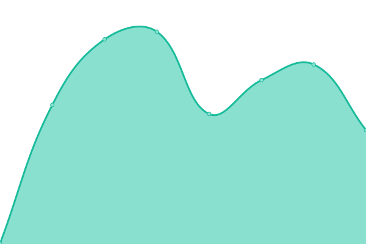
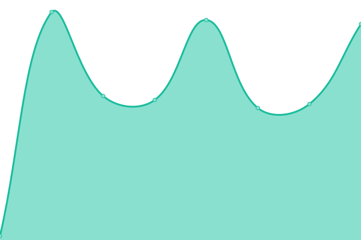

# [📈 Live Status](https://muuvlabs-upptime.github.io/muuvlabs-upptime/): <!--live status--> **🟩 All systems operational**

This repository contains the open-source uptime monitor and status page for [MuuvLabs](https://muuvlabs.com), powered by [Upptime](https://github.com/upptime/upptime).

<!--start: status pages-->
<!-- This summary is generated by Upptime (https://github.com/upptime/upptime) -->
<!-- Do not edit this manually, your changes will be overwritten -->
<!-- prettier-ignore -->
| URL | Status | History | Response Time | Uptime |
| --- | ------ | ------- | ------------- | ------ |
|  [Community Production](https://community.sebrands.com/community/_healthz) | 🟩 Up | [community-production.yml](https://github.com/muuvlabs-upptime/muuvlabs-upptime/commits/HEAD/history/community-production.yml) | 

 252ms
     
 | 

<a href="https://muuvlabs-upptime.github.io/muuvlabs-upptime/history/community-production">100.00%</a>
    

|  [Program Engine Production](https://pe.sebrands.com/pe/_healthz) | 🟩 Up | [program-engine-production.yml](https://github.com/muuvlabs-upptime/muuvlabs-upptime/commits/HEAD/history/program-engine-production.yml) | 

 819ms
     
 | 

<a href="https://muuvlabs-upptime.github.io/muuvlabs-upptime/history/program-engine-production">100.00%</a>
    

|  [Nutrition Production](https://nutrition.sebrands.com/nutrition/_healthz) | 🟩 Up | [nutrition-production.yml](https://github.com/muuvlabs-upptime/muuvlabs-upptime/commits/HEAD/history/nutrition-production.yml) | 

 252ms
     
 | 

<a href="https://muuvlabs-upptime.github.io/muuvlabs-upptime/history/nutrition-production">100.00%</a>
    

|  [Referrals Production](https://referrals.sebrands.com/referrals/scripts/landing.js) | 🟩 Up | [referrals-production.yml](https://github.com/muuvlabs-upptime/muuvlabs-upptime/commits/HEAD/history/referrals-production.yml) | 

 269ms
     
 | 

<a href="https://muuvlabs-upptime.github.io/muuvlabs-upptime/history/referrals-production">100.00%</a>
    

|  [VHS Production](https://vhs.sebrands.com/vhs/episodes) | 🟩 Up | [vhs-production.yml](https://github.com/muuvlabs-upptime/muuvlabs-upptime/commits/HEAD/history/vhs-production.yml) | 

 241ms
     
 | 

<a href="https://muuvlabs-upptime.github.io/muuvlabs-upptime/history/vhs-production">100.00%</a>
    

|  [muuvlabs.com Website](https://muuvlabs.com/) | 🟩 Up | [muuvlabs-com-website.yml](https://github.com/muuvlabs-upptime/muuvlabs-upptime/commits/HEAD/history/muuvlabs-com-website.yml) | 

 326ms
     
 | 

<a href="https://muuvlabs-upptime.github.io/muuvlabs-upptime/history/muuvlabs-com-website">100.00%</a>
    

|  [api.muuvlabs.com](https://api.muuvlabs.com/) | 🟩 Up | [api-muuvlabs-com.yml](https://github.com/muuvlabs-upptime/muuvlabs-upptime/commits/HEAD/history/api-muuvlabs-com.yml) | 

 248ms
     
 | 

<a href="https://muuvlabs-upptime.github.io/muuvlabs-upptime/history/api-muuvlabs-com">100.00%</a>
    

|  [muuv.fit website](https://muuv.fit/) | 🟩 Up | [muuv-fit-website.yml](https://github.com/muuvlabs-upptime/muuvlabs-upptime/commits/HEAD/history/muuv-fit-website.yml) | 

 356ms
     
 | 

<a href="https://muuvlabs-upptime.github.io/muuvlabs-upptime/history/muuv-fit-website">100.00%</a>
    

|  [muuv.fit API](https://muuv.fit/api/users/me) | 🟩 Up | [muuv-fit-api.yml](https://github.com/muuvlabs-upptime/muuvlabs-upptime/commits/HEAD/history/muuv-fit-api.yml) | 

 62ms
     
 | 

<a href="https://muuvlabs-upptime.github.io/muuvlabs-upptime/history/muuv-fit-api">100.00%</a>
    

|  [24go API](https://api.24go.co/users/me) | 🟩 Up | [24go-api.yml](https://github.com/muuvlabs-upptime/muuvlabs-upptime/commits/HEAD/history/24go-api.yml) | 

 135ms
     
 | 

<a href="https://muuvlabs-upptime.github.io/muuvlabs-upptime/history/24go-api">100.00%</a>
    

<!--end: status pages-->

[**Visit our status website →**](https://demo.upptime.js.org)

## 📄 License

- Powered by: [Upptime](https://github.com/upptime/upptime)
- Code: [MIT](./LICENSE) © [Upptime](https://upptime.js.org)
- Data in the `./history` directory: [Open Database License](https://opendatacommons.org/licenses/odbl/1-0/)
